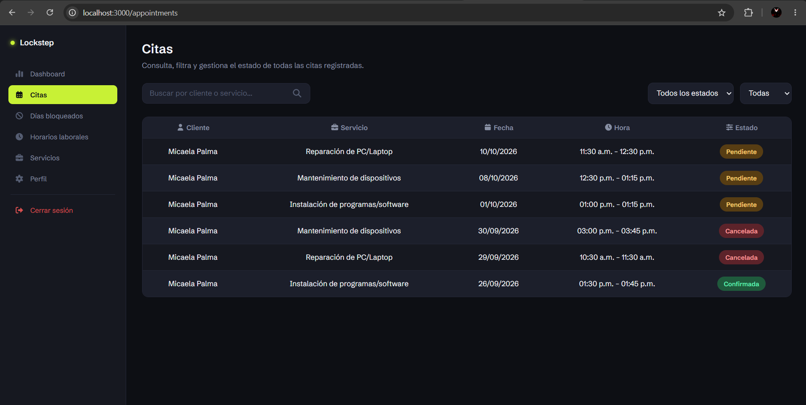
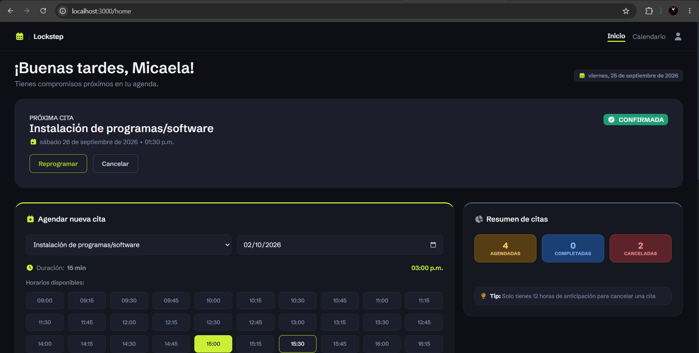
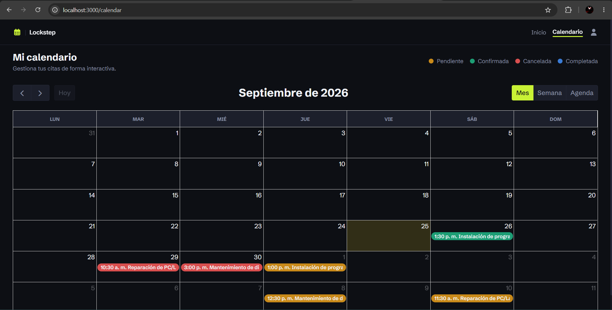

# 🚀 Lockstep – Frontend

A responsive, role-aware scheduling interface built with **Next.js**, designed to consume the [Lockstep Backend API](https://github.com/EdannyDev/backend-appointment) and provide a smooth booking experience for both clients and administrators.

## 📌 Overview

Lockstep Frontend is a Next.js application that provides an interactive scheduling interface with real-time availability visualization.

It integrates a dynamic calendar system and enforces role-based UI control, communicating with the backend exclusively through a REST API secured with HttpOnly cookies. Built as a portfolio project to demonstrate end-to-end ownership of a real scheduling flow: role-based UI, a fully responsive layout, and a clean, single-token theming system rather than scattered ad-hoc styles.

## 🖼 Screenshots

**Admin Panel** — data table with search, filters and pagination



**Client Panel** — booking flow and interactive calendar




## 📊 Core Features

- Interactive appointment calendar (FullCalendar)
- Service selection module
- Booking, rescheduling (modal + calendar drag-and-drop) and cancellation flow
- Administrative control dashboard
- Business hour configuration interface
- Blocked-days management (admin)
- Fully responsive layout (mobile, tablet, desktop)

## 🎨 UI & Architecture

- Two distinct layouts sharing the same design system: a collapsible sidebar for the **Admin panel** and a top navbar for the **Client panel**
- Reusable, composable components (`modal`, `modalReschedule`, `notification`, `pagination`, `loader`)
- Centralized Axios instance (`lib/axiosInstance.js`) for API communication
- Request-level resilience via `lib/withRetry.js`, which retries transient failures (e.g. backend cold starts, unstable connections) with a fixed delay, skipping retries on any 4xx response since those already reflect a valid decision from the backend
- Route config centralized in `config/appRoutes.js`, auth state in `context/authContext.jsx`
- FullCalendar integration with dynamic view switching
- Role-based route protection with a global 401 interceptor
- One dedicated style file per page/component (`*.styles.js`) built on Emotion, plus a shared CSS custom property system (`globals.css`) for consistent theming

The application emphasizes clarity, responsiveness and scheduling usability.

## 🔐 Authentication Handling

- Secure session handling via HttpOnly cookies (managed by backend)
- Cookies configured as `SameSite=None; Secure` to support cross-site auth, since the frontend (Vercel) and backend (Render) are served from different domains in production
- Role-based rendering (Admin / Client)
- Protected routes with automatic redirection for unauthorized users
- Global 401 interceptor for expired/invalid sessions

## 🛠 Tech Stack

| Category         | Technologies |
|-------------------|--------------|
| Framework          | Next.js 14, React 18 |
| Styling            | Emotion (styled + react) |
| Calendar           | FullCalendar (core, daygrid, timegrid, list, interaction) |
| Icons              | FontAwesome (solid, regular, react) |
| HTTP Client        | Axios |
| Package Manager    | Yarn |
| Linting            | ESLint (eslint-config-next) |

## ⚙️ Getting Started

### Prerequisites

- Node.js 18+
- Yarn
- The [backend API](https://github.com/EdannyDev/backend-appointment) running locally or deployed

### Installation

```bash
git clone https://github.com/EdannyDev/frontend-appointment.git
cd frontend-appointment
yarn install
```

### Environment Variables

Copy `.env.example` to `.env.local` and adjust the values for your environment:

```bash
cp .env.example .env.local
```

| Variable               | Description                              | Example                     |
|-------------------------|-------------------------------------------|------------------------------|
| `NEXT_PUBLIC_API_URL`  | Base URL of the backend REST API          | `http://localhost:5000/api/v2`|

### Running the App

```bash
yarn dev
```

The app will be available at `http://localhost:3000`.

## 📜 Available Scripts

| Script         | Description                          |
|-----------------|----------------------------------------|
| `yarn dev`      | Runs the app in development mode       |
| `yarn build`    | Builds the app for production          |
| `yarn start`    | Runs the built app in production mode  |
| `yarn lint`     | Runs ESLint checks                     |

## 📱 Responsive Design

The interface is fully responsive from a 768px breakpoint down to mobile, covering the navbar, collapsible sidebar, client and admin views, authentication pages, and all reusable components — while preserving the original desktop interaction patterns.

## 🌐 Live Demo

Deployed on [Vercel](https://vercel.com), consuming the backend API deployed on [Render](https://render.com):

**[lockstep-edannydev.vercel.app](https://lockstep-edannydev.vercel.app)**

---

Backend API: [backend-appointment](https://github.com/EdannyDev/backend-appointment) · Author: [@EdannyDev](https://github.com/EdannyDev)